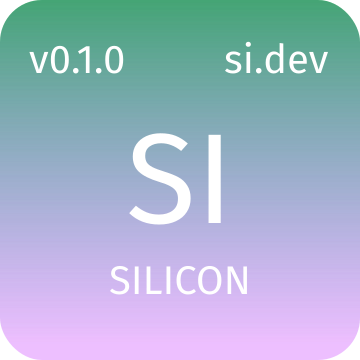

# The Silicon Language Specification

1 Feb 2024: starting WASM generation

## Table of Contents

- [grammar](./docs/grammar.md)
- [comments](./docs/comments.md)
- [sigils](./docs/sigils.md)
- [keywords](./docs/keywords.md)
- [identifiers](./docs/identifiers)
- [types](./docs/types.md)
- [operators](./docs/operators.md)
- [assignment](./docs/assignment.md)
- [equality & identity](./docs/equality-identity.md)
- [conditional](./docs/conditional.md)
- [loops](./docs/loops.md)
- [functions](./docs/functions.md)
- [methods](./docs/tdnr.md)
- [mutability](./docs/mutability.md)
- [modules](./docs/modules.md)
- [concurrency](./docs/concurrency.md)
- [dialects](./docs/dialects.md)

  

<h1 align="center">Silicon</h1>

> Silicon is a new programming language that emphasizes simplicity, extensibility and usability. It is extremely easy to learn and extremely difficult to use incorrectly. The main target is WASM. This is the specification, currently just the PEG grammar, for the language.

## Goals

- WASM compilation target
- Full-Stack web dev
- blazingly fast compilation
- interpreted for fast dev cycles
- Algebraic Data Types
- Pattern Matching
- 100% Type Inference (safety without type gymnastics)
- Co-routines (no colored functions)
- ARC (no GC)
- 100% Web API compatability
- 100% Node API compatability

## Non-Goals

In my opinion, non-goals are just as important as goals. They prevent scope-screep and keep the language and toolchain _great_ at specific use-case instead of
mediocre at everything.

\*Not a direct goal but other tools will be used
\*\*A future, much less important goal to think about

- Native Compilation\*
- LLVM / other native backends\*
- ~~Variadic functions~~
- ~~Function over-loading~~
- Game dev
- Systems dev (Yes, even though Silicon has no GC and is fairly "low-level")
- Operator overloading
- Functionally Pure
- Borrower Checker / compile-type memory safety\*\*

## SI puts the SI in Simple.

- no unary operators
- no operator precedence
- no operator overloading
- no inheritance
- no function / method overloading (TDNR so kinda `@let x = 1; x.toString; @let y = $false; y.toString`)
- no modifiers (just annotations)
- no garbage collector: reference counting / borrower checker (optional)
- ONE function syntax `@func` (named, anonymous, lambda)
- ONE looping expression `@loop` (for, while and do/while)
- ONE condition expression `@when` (if and switch/case)

## What SI DOES have

- Traits (because they're awesome)
- Annotations (for flexiblity)
- UFCS (fake methods)
- TDNR (fake overloading)
- ADT (Algebraic Data Type;the best type of type)
- SIMPLE and consistent syntax
- coroutines: no locks, mutexes / semaphores or runtime to schedule concurrent tasks
- Pattern matching
- Full type inference!
- Full lifetime inference!
- Large standard library (many native libraryes from C, C++ and Rust)
  - Common integrations (SQL, websockets, graphql, ORMs, Kafka, Graphics etc)
- Native dependency injection
- Native testing (within the same file)
- Great errors as values and error handling
- Generics
- Sinq (Silicon equivalent of C# LINQ)
- Cross-platform!
- Cross-compilation (thanks Zig cc!)
- C interop!
- 100% Web API coverage
- 100% Node API coverage

## Grammar

Silicon's grammar is extremely regular and straight forward. That does make it simple but simple is simply (pun intended) a
by product of using a few simple grammar rules everywhere for everything.

My goal is to keep Silicon's grammar to around 100 lines of PEG grammar. It may grow but it should never be more than 150-200 LOC. 100-125 is more realistic.

## Key Features

Silicon's goal is to only have the most expressive and versatile language features.

Influenced from: Ruby, Lua, Zig, Rust, LISP, ML

1. ML Algebraic Data Types
1. ML Function Definition Pattern Matching
1. ML Hindley-Milner Type System: 100% Type Inference
1. ML Effectful Type System: total, exception, timeout/nohault, pure(previous two), IO, random, parallel
1. Lua Co-routines
1. Lua (self)Embeddable as a Dynamically Typed Scripting Language
1. Ruby Blocks: non-local returns, thread safe etc..
1. WASM output: fast, safe, cross-platform, interop, ecosystem
1. No GC: ARC, Generational References, manual or Lifetimes, MAYBE a tracing GC for the backend.
1. JS 100% Web API and Node API compatability

### Other features

1. Very simple and regular grammar
1. Easy and fast to parse
1. Forced DI of I/O Functions
1. UFCS (fake methods) & TDNR (fake overloading)
1. LISP style macros / quotes?
1. Language Interop via WASM and Zig. Uses many proven Native Libraries.
1. Zig CC Cross-Compilation
1. Rust borrower checker / lifetimes BUT without writing the lifetimes
