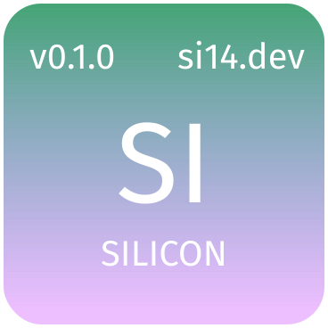

# The Silicon Language Specification

## Table of Contents

- [grammar](./docs/grammar.md)
- [comments](./docs/comments.md)
- [sigils](./docs/sigils.md)
- [keywords &amp; identifiers](./docs/identifiers.md)
- [types](./docs/types.md) Requires more thinking
- [operators](./docs/operators.md)
- [assignment](./docs/assignment.md)
- [equality & identity](./docs/equality-identity.md)
- [conditional](./docs/conditional.md)
- [loops](./docs/loops.md)
- [functions](./docs/functions.md)
- [methods](./docs/tdnr.md)
- [mutability](./docs/mutability.md)
- [modules](./docs/modules.md)
- [concurrency](./docs/concurrency.md)
- [Sulfur](./docs/sulfur.md)

<p align="center">
  
</p>

<h1 align="center">Silicon</h1>

> Silicon is a new programming language that emphasizes simplicity, extensibility and usability. It is extremely easy to learn and extremely difficult to use incorrectly. The main target is WASM. This is the specification with documentation on all the future features.

## Goals

- WASM compilation target
- Full-Stack web dev
- blazingly fast compilation
- interpreted for fast dev cycles
- Algebraic Data Types
- Pattern Matching
- 100% Type Inference (safety without type gymnastics)
- Co-routines (no colored functions)
- ARC (no GC)
- 100% Web API compatability
- 100% Node API compatability

## Non-Goals

In my opinion, non-goals are just as important as goals. They prevent scope-screep and keep the language and toolchain _great_ at specific use-case instead of mediocre at everything.

\*Not a direct goal but other tools will be used
\*\*A future, much less important goal to think about

- Native Compilation\*
- LLVM / other native backends\*
- Variadic functions \* Silicon Dynamic
- Function over-loading \* Silicon Dynamic
- Game dev
- Systems dev (Yes, even though Silicon has no GC and is fairly "low-level". It is NOT anything like Zig nor Rust)
- Operator overloading \* use infix functions instead
- Functionally Pure \* functional, may have an effects system but it isn't Haskell nor purescript
- Borrower Checker / compile-type memory safety\*\*

## SI puts the SI in Simple.

- no unary operators
- no operator precedence
- no methods
- no inheritance
- no function / method overloading (TDNR so kinda `@let x = 1; x.toString; @let y = $false; y.toString`)
- no modifiers (just annotations)
- no garbage collector: reference counting / borrower checker (optional)
- ONE function syntax `@fn` (named, anonymous, lambda)
- ONE looping expression `@loop` (for, while and do/while)
- ONE condition expression `@when` (if and switch/case

```silicon

# if function
&if cond, then, else;

# when function: compare_value, keys, values, default
&when value, [true, false], [1, -1], 0;

# with named params
&when value 
  $is true $then 1 
  $is false $then -1 
  $else else;
```

## What SI DOES have

- Native Testing (Unit, Fuzz)
- Protocols: Typesafe usage and upgrades to APIs
- Row Polymorphism
- Algebraic Effects
- Annotations (for flexiblity)
- TDNR (fake overloading)
- SIMPLE and consistent syntax
- Parallel Parsing
- Coroutines: no locks, mutexes / semaphores or runtime to schedule concurrent tasks
- Pattern matching
- Full type inference!
- Full lifetime inference!
- Large standard library (many native libraryes from C, C++ and Rust)
  - Common integrations (SQL, websockets, graphql, ORMs, Kafka, Graphics etc)
- Great errors as values and error handling
- Cross-platform!
- Sandboxed (WASM)
- 100% Web API coverage
- 100% Node API coverage
- WASI(X) APIs
- Self-embeddable


## Grammar

Silicon's grammar is extremely regular and straight forward. That does make it simple but simple is simply (pun intended) a
by product of using a few simple grammar rules everywhere for everything.

Silicon has only two Semantic grammar rules: Statements and Expressions.

My goal is to keep Silicon's grammar to around 100 lines of PEG grammar. It may grow but it should never be more than 150-200 LOC. 100-125 is more realistic.
For comparison, Zig which is very minimalistic uses 300 lines of PEG grammar.

## Key Features

Silicon's goal is to only have the most expressive and versatile language features.

Influenced by: Ruby, Lua, Zig, Rust, LISP, ML, Effiel...

1. ML Algebraic Data Types
1. ML Function Definition Pattern Matching
1. ML Hindley-Milner Type System: 100% Type Inference
1. ML Effectful Type System: total, exception, timeout/nohault, pure(previous two), IO, random, parallel
1. Co-routines
1. (self)Embeddable as a Dynamically Typed Scripting Language
1. WASM output: fast, safe, cross-platform, interop, ecosystem
1. GC optional: ARC, Generational References, manual or Lifetimes, MAYBE a tracing GC for the backend.
1. JS 100% Web API and Node API compatability
1. Protocols: API usage and upgrade help
1. SilVer: Silicon (smart) Versioning. No more failing at SemVer.
1. Capabilities: Permissions in code
1. Idiomatic Merging: Via Git or NIT. Language aware code merging!
1. Quasi-Quoting (Lisp style macros that work on the AST! Are hygenic and use comptime)

### Other features

1. Very simple and regular grammar
1. Easy and fast to parse
1. Forced DI of I/O Functions
1. UFCS (fake methods) & TDNR (fake overloading)
1. Pipe syntax ( when UFCS isn't needed)
1. LISP style macros / quotes?
1. Language Interop via WASM and Zig. Uses many proven Native Libraries.
1. Zig CC Cross-Compilation
1. Rust borrower checker / lifetimes BUT without writing the lifetimes


## KEYWORDS

```silicon
def / fn
when
loop
number
  integer
  real / float
  decimal
string 
codepoint / char / rune
boolean
```

Different letter each:

- def
- when 
- loop
- number
- integer
- float
- decimal
- string
- rune
- boolean

Here is the list in alphabetical order:

- boolean  
- currency (decimal)
- def / fn
- float  
- integer  
- loop 
- macro 
- number 
- rune 
- string 
- var / let
- when 